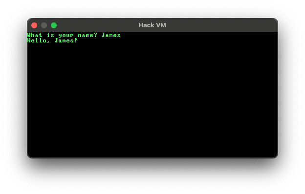

# Jack Platform

This is a hobby project to re-implement the Nand2Tetris stack using Rust. To learn Rust and because the resulting runtime should be much faster than my TypeScript version.

The initial focus is on developing a runtime capable of executing Hack assembly language, along with an assembler to parse the source code.

After that, perhaps building up the Virtual Machine runtime as well as a Jack compiler.

It would also be worth exploring web assembly at some point, as it would be interesting to see how much faster a wasm runtime would be compared to JavaScript.

# Progress

- [x] Implement runtime
- [x] Implement assembler
- [x] Web assembly package
- [x] Render output to window
- [x] Send keyboard input
- [ ] IR parser
- [ ] Jack compiler

# Example output

Running in a terminal:

Running in a browser through web assembly:

Displaying input and output:

# Assembling Algorithm

It has come to my attention that in a sufficiently long program with labels we can run into problems.

1: @MyLabel
... other assembly code
32674: (MyLabel)

The problem is that the index of MyLabel is larger than a 15-bit integer, which means it rolls over into a value which
is too large to load in a single immediate. The solution is to split into two instructions:

Instead of trying to load, say, 0b1000_0000_0000_0000, we flip the bits to a value we can load (0b0111_1111_1111_1111) then execute
A=!A to get A back to the desired value.

The problem now is that it is easy to calculate the index of a label when all assembly instructions map to one hack instruction.

The assembly @MyLabel now actually maps to two instructions, but how do we know it maps to two instructions without jumping down to (MyLabel)?

00001: @MyLabelOnEdge
00002: @MyLabelOverEdge
...
       (MyLabelOnEdge)
32767: 0
       (MyLabelOverEdge)
32768: 0

00001: @32767 <-- wrong
00002: @32767
00003: A=!A <-- new instruction added, so the previous label is now at 32768

// loop through all labels and generate a naive index

// loop through all jumps and add a reference to each label
  // if we have to generate 2 instructions to jump:
    // update all labels with an index **larger** than the index we're currently generating at
    // regenerate that label's existing references
    // if one of the existing references that we regenerated crossed the 15-bit threshold, run the same steps again

