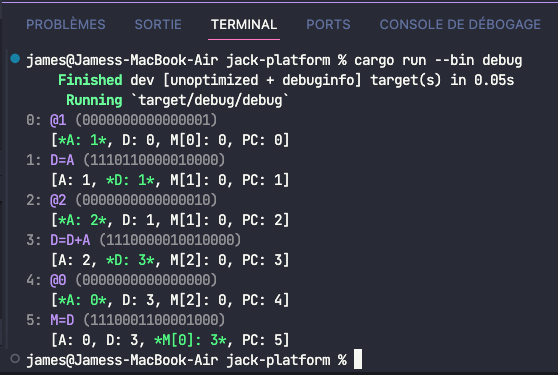
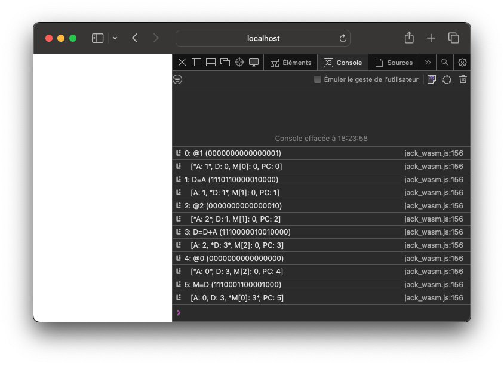

# Jack Platform

This is a hobby project to re-implement the Nand2Tetris stack using Rust. To learn Rust and because the resulting runtime should be much faster than my TypeScript version.

The initial focus is on developing a runtime capable of executing Hack assembly language, along with an assembler to parse the source code.

After that, perhaps building up the Virtual Machine runtime as well as a Jack compiler.

It would also be worth exploring web assembly at some point, as it would be interesting to see how much faster a wasm runtime would be compared to JavaScript.

# Example output

Running in a terminal:

Running in a browser through web assembly:

